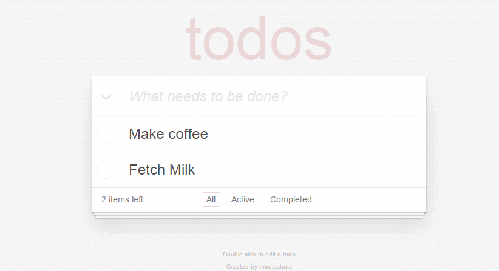

# React + MobX TodoMVC Example

This repository provides a reference implementation of the [TodoMVC](http://todomvc.com) application written using [MobX](https://github.com/mobxjs/mobx), [React](https://facebook.github.io/react) JSX and ES6.

## Running the example

```
npm install
npm start
open http://localhost:3000
```

The example requires node 4.0 or higher



## Testing XSS
Add the below line as todo and reload the page... boom!!!!
```
</script><script>alert(1);</script>
```

## Fix XSS issue


#### Step 1:

In ``package.json`` add following line ```"jsesc": "^2.3.0"``` in dependencies and do ```npm i```
#### (OR)                                            
Install ```jsesc``` using ```npm install jsesc```


#### Step 2:

In ```src/client.js``` replace ```const initialState = window.initialState || {};``` with ```const initialState = window.initialState && JSON.parse(window.initialState) || {};``` 


#### Step 3:

In ```src/server.js``` add following code under ```renderFullPage``` function

```
const initialStateJSON = escape( // So safe!
		JSON.stringify(initialState),
		{ wrap: true, isScriptContext: true, json: true }
	);
  
```


#### Step 4:

In ```src/server.js``` replace ```window.initialState = ${JSON.stringify(initialState)}``` with ```window.initialState = ${initialStateJSON}```


## Changing the example

If you are new to MobX, take a look at the [ten minutes, interactive introduction](https://mobxjs.github.io/mobx/getting-started.html) to MobX and React. MobX provides a refreshing way to manage your app state by combining mutable data structures with transparent reactive programming.

The state and actions of this app are defined in two stores; `todoModel` and `viewModel`.
This is not necessary but it provides a nice separation of concerns between data that effects the domain of the application and data that affects the user interface of the application.
This is a useful distinction for testing, reuse in backend services etc.

The project uses hot-reloading so most changes made to the app will be picked automatically.
By default the `mobx-react-devtools` are enabled as well. During each rendering a small render report is printed on all updated components.
The dev-tools can be disabled by commenting the `import` statement in `src/index.js`.
